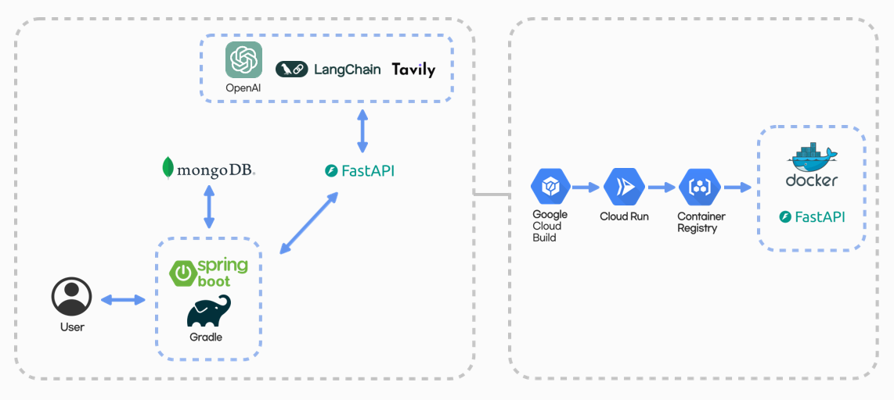

# 👨‍👨‍👧‍👦 교육기관용 프로젝트 기획서 생성 LLM <써드림> 👨‍👨‍👧‍👦

개발 일정 : **2024.03.15 ~ 2024.04.15**

사용언어 :     

사용 프레임워크 & 라이브러리 :     

사용 API :   GPT4, LangChain, Tavily API   

> 주제만 입력하면 기획서를 생성해주는 써드림! 👉 [써드림 바로가기](http://54.234.210.249:8087)   

  

## 📃 Description
아무래도 쓰기 좀 귀찮은 프로젝트 기획서를 대신 작성해주는 써드림입니다.  
내가 생성하고 싶은 기획서의 주제를 입력하고 생성하기를 눌러보세요! 써드림이 최신 업계동향까지 참고해 기획서를 생성해드립니다.
혹시 참고하고 싶은 뉴스기사나 논문이 있다면 주소도 함께 입력하고 생성하기를 누르시면 됩니다.

## Demo

## ⭐ Main Feature
### 기획서 생성 기능
  - 프로젝트 기획서 생성 기능
### 기획서 다운로드 기능
  - 생성된 기획서 docx 파일로 다운받기 기능

## 🔨 Server Architecture

